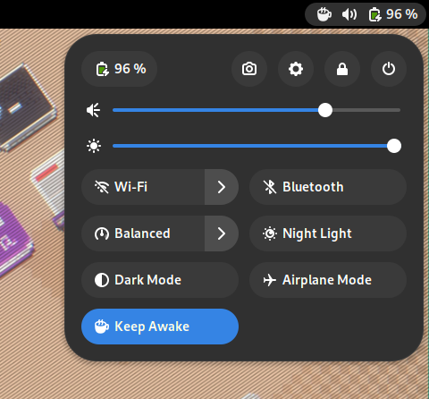

# Keep Awake

Keep Awake is a GNOME Shell extension that disables the screensaver and the screen lock.

It is useful for watching videos or presentations or when you need to keep your computer on for a long time without having to interact with it (e.g. when you're downloading something) also without having to fiddle with the power settings.

## Screenshot



## Download

Install from source by cloning this repository.

### Pack

```sh
git clone https://github.com/vixalien/gnome-shell-extension-awake.git &&  \
  cd gnome-shell-extension-awake && \
  gnome-extensions pack &&
  gnome-extension install awake@com.vixalien.com.shell-extension.zip
```

Restart GNOME by logging out and back in.

## Inspiration

This extension is heavily inspired by the [Caffeine](https://extensions.gnome.org/extension/517/caffeine/) and [Espresso](https://extensions.gnome.org/extension/4135/espresso/) extensions.